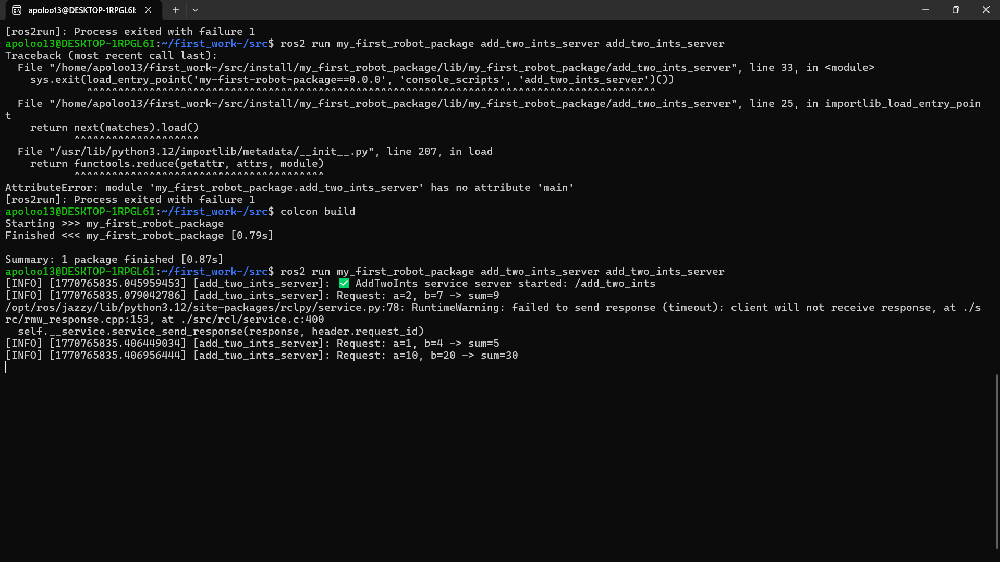

# ROS 2 Services (AddTwoInts) | Client + Server

## 1. Overview

This activity implements a ROS 2 service using `rclpy` and the interface `example_interfaces/srv/AddTwoInts`.
A service follows a request/response model:

- A client sends a request (two integers: `a`, `b`).
- A server computes the result.
- The server returns a response (the integer `sum`).

Service name used in this activity: `/add_two_ints`  
Service type used in this activity: `example_interfaces/srv/AddTwoInts`

---

## 2. Objectives

- Create a Service Server node that provides `/add_two_ints`.
- Create a Service Client node that calls `/add_two_ints` and prints results.
- Build and run both nodes from a ROS 2 Python package.
- Validate the service using `ros2 service call`.
- Collect evidence (diagrams and terminal outputs) for the report.

---

## 3. Requirements

Software:
- ROS 2 installed and sourced
- Python 3
- Package dependency: `example_interfaces`

Useful interface inspection command:

```bash
ros2 interface show example_interfaces/srv/AddTwoInts
```

Expected fields (summary):
- Request: `int64 a`, `int64 b`
- Response: `int64 sum`

---

## 4. Package structure

Recommended structure for an `ament_python` package:

```
my_first_robot_package/
├─ package.xml
├─ setup.py
├─ setup.cfg
└─ my_first_robot_package/
   ├─ __init__.py
   ├─ add_two_ints_server.py
   └─ add_two_ints_client.py
```

Important:
- The Python scripts must be inside the module folder:
  `my_first_robot_package/my_first_robot_package/`

---

## 5. Diagram and evidence placeholders (images)


---

## 6. Service Server node

File: `my_first_robot_package/add_two_ints_server.py`

### 6.1 Purpose

The server node:
- Creates a service named `add_two_ints` (visible as `/add_two_ints`).
- Receives a request containing `a` and `b`.
- Computes `sum = a + b`.
- Returns the result in the response.

### 6.2 Code (server)

```python
#!/usr/bin/env python3
import rclpy
from rclpy.node import Node

from example_interfaces.srv import AddTwoInts


class AddTwoIntsServerNode(Node):
    def __init__(self):
        super().__init__("add_two_ints_server")

        # Create the service server: (type, service_name, callback)
        self._server = self.create_service(
            AddTwoInts,
            "add_two_ints",  # service name (will appear as /add_two_ints)
            self.callback_add_two_ints,
        )

        self.get_logger().info("AddTwoInts service server started: /add_two_ints")

    def callback_add_two_ints(self, request: AddTwoInts.Request, response: AddTwoInts.Response):
        # Compute result
        response.sum = request.a + request.b

        # Log for visibility
        self.get_logger().info(f"Request: a={request.a}, b={request.b} -> sum={response.sum}")

        # IMPORTANT: you must return the response in Python
        return response


def main(args=None):
    rclpy.init(args=args)
    node = AddTwoIntsServerNode()

    try:
        rclpy.spin(node)
    except KeyboardInterrupt:
        pass
    finally:
        node.destroy_node()
        rclpy.shutdown()


if __name__ == "__main__":
    main()
```

---

## 7. Service Client node

File: `my_first_robot_package/add_two_ints_client.py`

### 7.1 Purpose

The client node:
- Creates a client for the service `add_two_ints` (i.e., `/add_two_ints`).
- Waits for the service to become available.
- Sends example requests to the server.
- Prints the results as soon as each response arrives.

This client uses asynchronous calls (`call_async`) and a callback to process results.

### 7.2 Code (client)

```python
#!/usr/bin/env python3
import rclpy
from rclpy.node import Node
from functools import partial
from example_interfaces.srv import AddTwoInts


class AddTwoIntsClientNode(Node):
    def __init__(self):
        super().__init__("add_two_ints_client")

        # Create client once (service name must match server)
        self._client = self.create_client(AddTwoInts, "add_two_ints")

        # Example calls (send multiple requests)
        self.call_add_two_ints(2, 7)
        self.call_add_two_ints(1, 4)
        self.call_add_two_ints(10, 20)

    def call_add_two_ints(self, a: int, b: int):
        # Wait for service (safe startup)
        while not self._client.wait_for_service(timeout_sec=1.0):
            self.get_logger().warn("Service '/add_two_ints' not available, waiting...")

        # Build request
        request = AddTwoInts.Request()
        request.a = a
        request.b = b

        # Send async request
        future = self._client.call_async(request)

        # Register callback; pass request too (so we can log a + b)
        future.add_done_callback(partial(self.callback_call_add_two_ints, request))

    def callback_call_add_two_ints(self, request: AddTwoInts.Request, future):
        response = future.result()
        self.get_logger().info(f"{request.a} + {request.b} = {response.sum}")


def main(args=None):
    rclpy.init(args=args)
    node = AddTwoIntsClientNode()
    rclpy.spin(node)
    rclpy.shutdown()


if __name__ == "__main__":
    main()
```

---

## 8. Register executables in setup.py

In `setup.py`, ensure you have the console scripts:

```python
entry_points={
    "console_scripts": [
        "add_two_ints_server = my_first_robot_package.add_two_ints_server:main",
        "add_two_ints_client = my_first_robot_package.add_two_ints_client:main",
    ],
},
```

Common error:
- If the module does not define `main`, you will see an error similar to:
  `AttributeError: module ... has no attribute 'main'`

---

## 9. Build and run

### 9.1 Build the workspace

From the workspace root (adjust to your path):

```bash
cd ~/first_work-/src
colcon build --symlink-install
source install/setup.bash
```

### 9.2 Run the server (Terminal A)

```bash
source ~/first_work-/src/install/setup.bash
ros2 run my_first_robot_package add_two_ints_server
```



### 9.3 Run the client (Terminal B)

```bash
source ~/first_work-/src/install/setup.bash
ros2 run my_first_robot_package add_two_ints_client
```


Expected behavior:
- The server prints log lines each time it receives a request.
- The client prints the computed sums for each request.

---

## 10. Test the service from the CLI

With the server running, in another terminal:

```bash
source ~/first_work-/src/install/setup.bash
ros2 service list
ros2 service type /add_two_ints
ros2 service call /add_two_ints example_interfaces/srv/AddTwoInts "{a: 5, b: 9}"
```

Expected:
- The terminal prints the response containing `sum`.
- The server logs the request and result.

---

## 11. Optional verification commands

List nodes:

```bash
ros2 node list
```

List services:

```bash
ros2 service list
```

Visual graph:

```bash
rqt_graph
```

---

## 12. Troubleshooting

1) Client stays in: “Service '/add_two_ints' not available, waiting...”
- The server is not running, or the service name does not match.
- Confirm the server uses `"add_two_ints"` and that the service appears as `/add_two_ints`.

2) “executable not found” when running `ros2 run`
- The console scripts were not added to `setup.py`, or the workspace was not rebuilt.
- Rebuild and re-source the workspace.

3) “has no attribute 'main'”
- The file does not define `main()` at the top level, or `setup.py` points to the wrong function name.
- Ensure `def main(args=None):` exists and matches the entry point.

---
