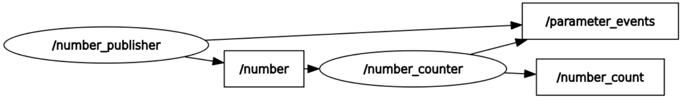
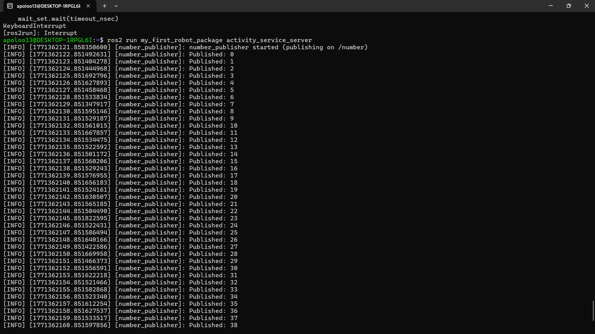
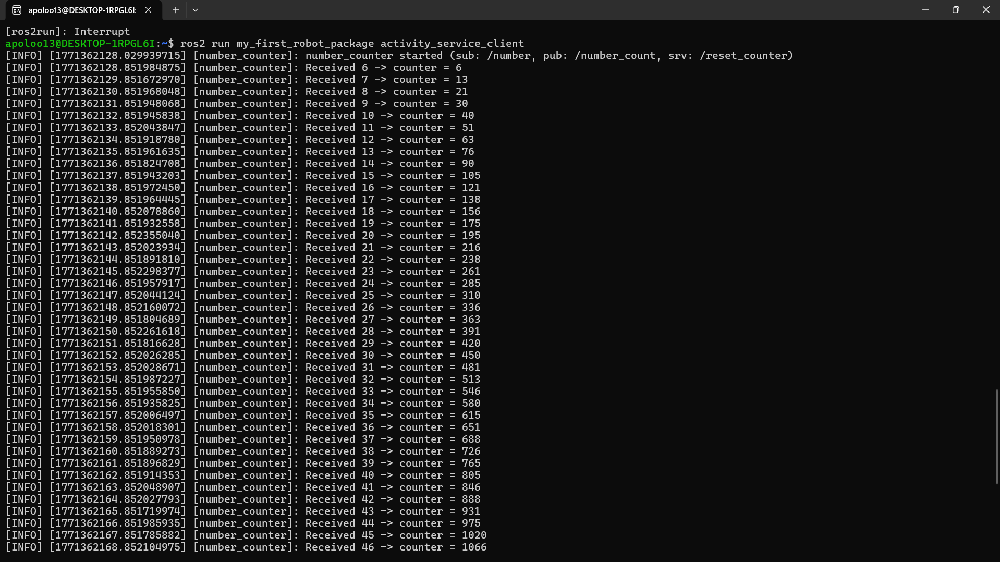

# ROS 2 Topics + Services (Reset Counter) | Publisher + Counter + SetBool Service

## 1. Overview

This activity extends a ROS 2 Topics example by adding a ROS 2 Service using `rclpy`.

You start with a Topics pipeline:

- A publisher node sends integers on `/number` using `example_interfaces/msg/Int64`.
- A counter node subscribes to `/number`, accumulates the values, and publishes the running total on `/number_count` using `example_interfaces/msg/Int64`.

Then you add a service inside the counter node:

Service name used in this activity: `/reset_counter`  
Service type used in this activity: `example_interfaces/srv/SetBool`

Service behavior:
- The client calls `/reset_counter` with a boolean request field `data`.
- If `data` is `true`, the counter value is reset to `0`.
- If `data` is `false`, the counter value is not modified.

Topics used in this activity:
- `/number` (type: `example_interfaces/msg/Int64`)
- `/number_count` (type: `example_interfaces/msg/Int64`)

---

## 2. Objectives

- Implement a publisher node that publishes an `Int64` number on `/number`.
- Implement a counter node that subscribes to `/number`, accumulates the values, and publishes on `/number_count`.
- Add a service server inside the counter node:
  - Name: `/reset_counter`
  - Type: `example_interfaces/srv/SetBool`
- Validate the service from the command line using `ros2 service call`.
- Collect evidence (diagrams and terminal outputs) for the report.

---

## 3. Requirements

Software:
- ROS 2 installed and sourced
- Python 3
- Package dependency: `example_interfaces`

Useful interface inspection commands:

```bash
ros2 interface show example_interfaces/msg/Int64
ros2 interface show example_interfaces/srv/SetBool
```

Expected fields (summary):

`example_interfaces/msg/Int64`
- Message: `int64 data`

`example_interfaces/srv/SetBool`
- Request: `bool data`
- Response: `bool success`, `string message`

---

## 4. Package structure

Recommended structure for an `ament_python` package:

```
my_first_robot_package/
├─ package.xml
├─ setup.py
├─ setup.cfg
└─ my_first_robot_package/
   ├─ __init__.py
   ├─ number_publisher.py
   └─ number_counter.py
```

Important:
- The Python scripts must be inside the module folder:
  `my_first_robot_package/my_first_robot_package/`

---

## 5. Diagram and evidence placeholders (images)




---

## 6. Publisher node

File: `my_first_robot_package/number_publisher.py`

### 6.1 Purpose

The publisher node:
- Creates a publisher on topic `/number`.
- Publishes an `Int64` message periodically (for example every 1 second).
- Increments the number each time it publishes.

### 6.2 Code (publisher)

```python
#!/usr/bin/env python3
import rclpy
from rclpy.node import Node
from example_interfaces.msg import Int64


class NumberPublisherNode(Node):
    def __init__(self):
        super().__init__("number_publisher")

        self._pub = self.create_publisher(Int64, "number", 10)
        self._timer = self.create_timer(1.0, self.publish_number)

        self._number = 0
        self.get_logger().info("number_publisher started (publishing on /number)")

    def publish_number(self):
        msg = Int64()
        msg.data = self._number
        self._pub.publish(msg)
        self.get_logger().info(f"Published: {msg.data}")
        self._number += 1


def main(args=None):
    rclpy.init(args=args)
    node = NumberPublisherNode()
    rclpy.spin(node)
    node.destroy_node()
    rclpy.shutdown()


if __name__ == "__main__":
    main()
```

---

## 7. Counter node (Subscriber + Publisher + Service Server)

File: `my_first_robot_package/number_counter.py`

### 7.1 Purpose

The counter node combines three roles:

1) Subscriber
- Subscribes to `/number` (`Int64`).
- Every time a number arrives, it adds it to a running total called `counter`.

2) Publisher
- Publishes the updated running total on `/number_count` (`Int64`).

3) Service server
- Provides a service named `/reset_counter` of type `SetBool`.
- When the service is called:
  - If `request.data == true`, the running total is reset to `0`.
  - The server replies with `success` and a `message` string describing what happened.

### 7.2 Code (counter + service)

```python
#!/usr/bin/env python3
import rclpy
from rclpy.node import Node

from example_interfaces.msg import Int64
from example_interfaces.srv import SetBool


class NumberCounterNode(Node):
    def __init__(self):
        super().__init__("number_counter")

        self._counter = 0

        # Subscriber: /number
        self._sub = self.create_subscription(
            Int64,
            "number",
            self.callback_number,
            10
        )

        # Publisher: /number_count
        self._pub = self.create_publisher(
            Int64,
            "number_count",
            10
        )

        # Service server: /reset_counter
        self._srv = self.create_service(
            SetBool,
            "/reset_counter",
            self.callback_reset_counter
        )

        self.get_logger().info(
            "number_counter started (sub: /number, pub: /number_count, srv: /reset_counter)"
        )

    def callback_number(self, msg: Int64):
        self._counter += msg.data

        out = Int64()
        out.data = self._counter
        self._pub.publish(out)

        self.get_logger().info(f"Received {msg.data} -> counter = {self._counter}")

    def callback_reset_counter(self, request: SetBool.Request, response: SetBool.Response):
        if request.data:
            self._counter = 0
            response.success = True
            response.message = "Counter reset to 0"
            self.get_logger().info("Service /reset_counter called with data=True -> counter reset to 0")
        else:
            response.success = False
            response.message = "Request data was false; counter not reset"
            self.get_logger().info("Service /reset_counter called with data=False -> no reset")

        return response


def main(args=None):
    rclpy.init(args=args)
    node = NumberCounterNode()
    rclpy.spin(node)
    node.destroy_node()
    rclpy.shutdown()


if __name__ == "__main__":
    main()
```

---

## 8. Register executables in setup.py

In `setup.py`, ensure you have these console scripts:

```python
entry_points={
    "console_scripts": [
        "number_publisher = my_first_robot_package.number_publisher:main",
        "number_counter = my_first_robot_package.number_counter:main",
    ],
},
```

Common error:
- If a module does not define `main`, you will see an error similar to:
  `AttributeError: module ... has no attribute 'main'`

---

## 9. Build and run

### 9.1 Build the workspace

From the workspace root (adjust to your path):

```bash
cd ~/first_work-/src
colcon build --symlink-install
source install/setup.bash
```

### 9.2 Run the publisher (Terminal A)

```bash
source ~/first_work-/src/install/setup.bash
ros2 run my_first_robot_package number_publisher
```



### 9.3 Run the counter node (Terminal B)

```bash
source ~/first_work-/src/install/setup.bash
ros2 run my_first_robot_package number_counter
```



Expected behavior:
- The publisher prints published values.
- The counter prints received values and updated `counter` totals.
- The counter publishes the running total on `/number_count`.

---

## 10. Test the system

### 10.1 Echo the running total

In another terminal:

```bash
source ~/first_work-/src/install/setup.bash
ros2 topic echo /number_count
```

You should see increasing totals as the counter accumulates numbers from `/number`.

### 10.2 Call the reset service from the CLI

With the counter node running:

```bash
source ~/first_work-/src/install/setup.bash
ros2 service call /reset_counter example_interfaces/srv/SetBool "{data: true}"
```

Expected:
- The service response returns `success: true` and a message.
- The internal counter value resets to `0`.
- The next published values on `/number_count` restart from the reset state.

Optional (no reset):

```bash
ros2 service call /reset_counter example_interfaces/srv/SetBool "{data: false}"
```

Expected:
- The service response returns `success: false`.
- The counter is not reset.

---

## 11. Optional verification commands

List nodes:

```bash
ros2 node list
```

List topics:

```bash
ros2 topic list
```

List services:

```bash
ros2 service list
```

Check service type:

```bash
ros2 service type /reset_counter
```

Visual graph:

```bash
rqt_graph
```

---

## 12. Troubleshooting

1) `ros2 run` says executable not found
- Confirm `setup.py` includes the console script entry points.
- Rebuild and re-source:

```bash
cd ~/first_work-/src
colcon build --symlink-install
source install/setup.bash
```

2) `/reset_counter` does not appear in `ros2 service list`
- The `number_counter` node is not running, or the service name differs.
- Confirm the service is created with `"/reset_counter"` and type `SetBool`.

3) `ros2 service call` fails with type errors
- Confirm the exact service type:

```bash
ros2 service type /reset_counter
```

- Confirm the interface:

```bash
ros2 interface show example_interfaces/srv/SetBool
```

4) `/number_count` does not update
- Ensure `number_publisher` is publishing on `/number`.
- Ensure `number_counter` subscribes to `"number"` and publishes `"number_count"`.

---
