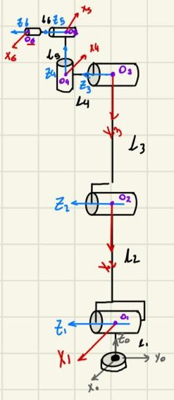
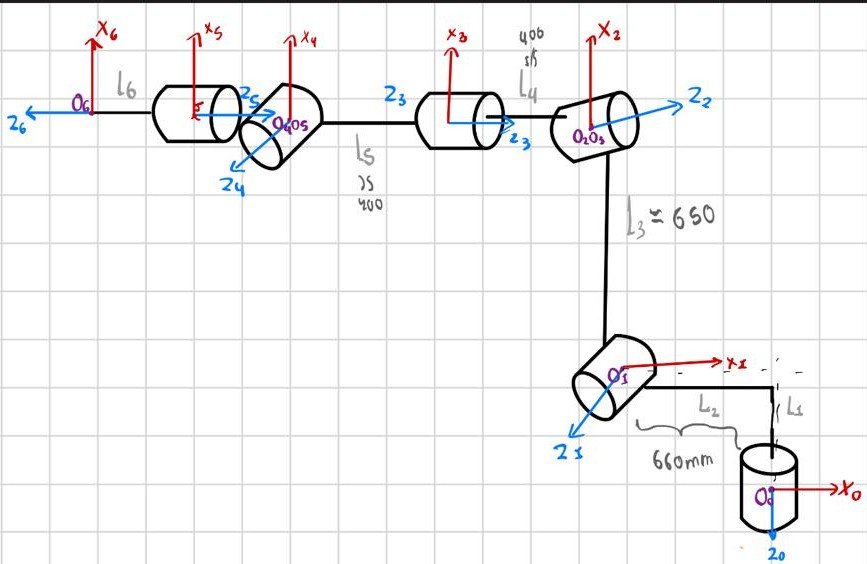

# Forward Kinematics using DH Parameters (UR5e and KUKA KR16)

## 1. Introduction

- UR5e (6-axis collaborative robot)
- KUKA KR16 (6-axis industrial robot)

Forward kinematics computes the end-effector pose (position and orientation) with respect to the base frame, given:

- The robot geometric parameters (link lengths and offsets)
- The joint variables (joint angles for revolute joints)

The result is typically expressed as a homogeneous transformation matrix:

\[
{}^{0}T_{6}(\mathbf{q}) =
\begin{bmatrix}
{}^{0}R_{6}(\mathbf{q}) & {}^{0}p_{6}(\mathbf{q}) \\
0\;0\;0 & 1
\end{bmatrix}
\]

where:

- \( {}^{0}R_{6} \) is a 3×3 rotation matrix
- \( {}^{0}p_{6} \) is a 3×1 position vector
- \( \mathbf{q} = [q_1, q_2, q_3, q_4, q_5, q_6]^T \)

---

## 2. What is needed for forward kinematics

To compute FK using the Denavit–Hartenberg (DH) convention, you need:

1. A consistent frame assignment \( \{0\}, \{1\}, \dots, \{6\} \)
2. DH parameters for each joint/link pair
3. A joint vector \( \mathbf{q} \) (joint angles, in radians)
4. A convention (standard DH or a variant) and a consistent multiplication order

### 2.1 Standard DH parameters

For each link \( i \), the standard DH parameters are:

- \( a_i \): link length (translation along \( x_i \))
- \( d_i \): link offset (translation along \( z_{i-1} \))
- \( \alpha_i \): link twist (rotation about \( x_i \))
- \( \theta_i \): joint angle (rotation about \( z_{i-1} \))

For a revolute joint, \( \theta_i \) contains the variable \( q_i \) (possibly plus a constant offset).

### 2.2 Homogeneous transform for each link

Using standard DH, the transform from frame \( i-1 \) to \( i \) is:

\[
{}^{i-1}T_{i} =
R_z(\theta_i)\,T_z(d_i)\,T_x(a_i)\,R_x(\alpha_i)
\]

Its matrix form is:

\[
{}^{i-1}T_{i}=
\begin{bmatrix}
\cos\theta_i & -\sin\theta_i\cos\alpha_i & \sin\theta_i\sin\alpha_i & a_i\cos\theta_i \\
\sin\theta_i & \cos\theta_i\cos\alpha_i & -\cos\theta_i\sin\alpha_i & a_i\sin\theta_i \\
0 & \sin\alpha_i & \cos\alpha_i & d_i \\
0 & 0 & 0 & 1
\end{bmatrix}
\]

### 2.3 Full forward kinematics

Once each \( {}^{i-1}T_i \) is defined, multiply them in order:

\[
{}^{0}T_{6} =
{}^{0}T_{1}\,
{}^{1}T_{2}\,
{}^{2}T_{3}\,
{}^{3}T_{4}\,
{}^{4}T_{5}\,
{}^{5}T_{6}
\]

The end-effector position and orientation are taken from \( {}^{0}T_{6} \):

- Position: \( {}^{0}p_{6} = [T_{0,3},\,T_{1,3},\,T_{2,3}]^T \)
- Orientation: \( {}^{0}R_{6} \) is the top-left 3×3 block

If a tool/TCP offset is used, apply an additional transform:

\[
{}^{0}T_{TCP} = {}^{0}T_{6}\,{}^{6}T_{TCP}
\]

---

## 3. Model 1: UR5e forward kinematics (DH table)

### 3.1 Notes about the UR5e model

UR5e is a 6-DOF serial manipulator with a 3-DOF wrist. The DH table below uses symbolic geometric parameters \(L_1 \dots L_6\) and joint variables \(q_1 \dots q_6\).

Important modeling details:

- Angle offsets such as \(-\pi/2 + q_2\) are part of the frame assignment. They shift the zero position of a joint so that the DH frames align with a chosen “home” configuration.
- Length parameters \(L_i\) must be defined in consistent units (all in meters or all in millimeters).
- The resulting \( {}^{0}T_{6} \) depends on the chosen base frame and the end-effector frame definition (tool flange vs TCP).

### 3.2 Image placeholder (UR5e diagram)

Insert the UR5e kinematic diagram here (before the table):



### 3.3 UR5e DH table (LaTeX)

\[
\textbf{UR5e DH Parameters}=
\begin{array}{c|c|c|c|c}
\text{Link} & a_i & d_i & \alpha_i & \theta_i \\
\hline
1 & 0   & L_1 & \frac{\pi}{2}  & q_1 \\
2 & L_1 & 0   & 0                & -\frac{\pi}{2}+q_2 \\
3 & L_3 & 0   & 0                & q_3 \\
4 & 0   & L_4 & \frac{\pi}{2}  & -\frac{\pi}{2}+q_4 \\
5 & 0   & L_5 & -\frac{\pi}{2} & q_5 \\
6 & 0   & L_6 & 0                & -\pi+q_6
\end{array}
\]

### 3.4 How to compute the UR5e forward kinematics

1. Build each \( {}^{i-1}T_i \) using the matrix definition in Section 2.2 and the parameters from the table.
2. Substitute joint angles \(q_i\) (radians) and link constants \(L_i\).
3. Multiply all transforms in order to get \( {}^{0}T_{6} \).
4. Extract position and orientation from \( {}^{0}T_{6} \).
5. If you have a TCP/tool offset, multiply by \( {}^{6}T_{TCP} \).

---

## 4. Model 2: KUKA KR16 forward kinematics (DH-like table)

### 4.1 Notes about the KR16 model

KUKA KR16 is a 6-DOF industrial manipulator. Many KR-series robots are modeled with a DH (or DH-like) parameterization. The table below uses the symbols:

- \(L_i\): translational parameter (commonly used as an offset along the z-axis in DH-like models)
- \(D2_i\): translational parameter (commonly used as a distance along the x-axis in DH-like models)
- \(\theta_i\): joint angle (contains the variable \(q_i\) and possible constant offsets)
- \(\alpha_i\): twist angle between axes

This model is equivalent to the standard DH form if you interpret:

- \(d_i \leftarrow L_i\)
- \(a_i \leftarrow D2_i\)

and use:

\[
{}^{i-1}T_i = R_z(\theta_i)\,T_z(L_i)\,T_x(D2_i)\,R_x(\alpha_i)
\]

As with the UR5e, constant angle terms (for example \(\pi/2\) shifts) are tied to the chosen reference frames and the definition of the robot “zero” configuration.

### 4.2 Image placeholder (KR16 diagram)

Insert the KR16 kinematic diagram here (before the table):



### 4.3 KR16 parameter table (LaTeX)

\[
\textbf{KUKA KR16 Parameters}=
\begin{array}{c|c|c|c|c}
\text{Link} & L_i & D2_i & \theta_i & \alpha_i \\
\hline
1 & -L_1      & -L_2 & q_1            & -\frac{\pi}{2} \\
2 & 0         & L_3  & \frac{\pi}{2}+q_2 & \pi \\
3 & 0         & 0    & q_3            & \frac{\pi}{2} \\
4 & L_4+L_5   & 0    & q_4            & -\frac{\pi}{2} \\
5 & 0         & 0    & q_5            & \frac{\pi}{2} \\
6 & -L_6      & 0    & q_6            & \pi
\end{array}
\]

### 4.4 How to compute the KR16 forward kinematics

1. Use the transform definition \( {}^{i-1}T_i = R_z(\theta_i)\,T_z(L_i)\,T_x(D2_i)\,R_x(\alpha_i) \).
2. Substitute link constants \(L_i\), \(D2_i\) and joint variables \(q_i\).
3. Multiply the six transforms in order to obtain \( {}^{0}T_{6} \).
4. Extract \( {}^{0}p_{6} \) and \( {}^{0}R_{6} \).
5. Apply any TCP/tool transform if needed.

---

## 5. Practical implementation notes

### 5.1 Units and conventions

- Use consistent units for all length parameters (meters or millimeters).
- Use radians for all joint angles in calculations.
- Verify the chosen base frame orientation and the direction of each joint axis.
- If comparing with simulation (URDF, MoveIt, manufacturer software), ensure the same zero configuration and TCP definition.

### 5.2 Validation recommendations

To validate your FK model:

1. Choose one or more joint configurations \(\mathbf{q}\).
2. Compute \( {}^{0}T_{6}(\mathbf{q}) \) using your DH model.
3. Compare the pose with:
   - A trusted simulator (for example, URDF-based visualization)
   - Manufacturer software (where available)
4. If results differ by a constant transform, check TCP/tool offsets.
5. If results differ by sign or axis flips, check frame assignments and joint axis directions.

---

## 6. Example workflow (commands)

From the workspace root (adjust the path as needed):

```bash
cd ~/first_work-/src
colcon build --symlink-install
source install/setup.bash
```

Optional commands for verifying ROS 2 graph when running nodes:

```bash
ros2 node list
ros2 topic list
rqt_graph
```

---

## 7. Deliverables checklist

- DH/parameter tables included (UR5e and KR16)
- Two diagram placeholders inserted (one before each table)
- Forward kinematics method explained (link transforms and product of matrices)
- Notes about offsets, frames, units, and validation included
- Evidence images added (terminal output and graph) if required by the activity
