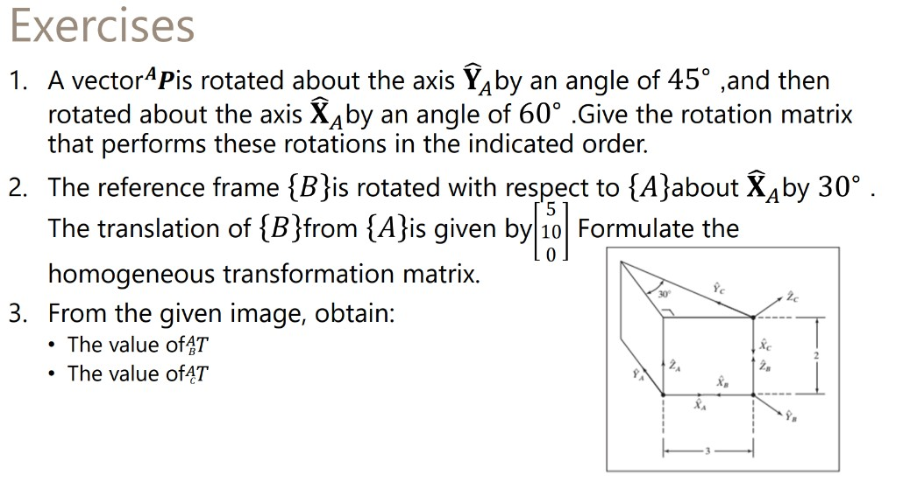

# Forward Kinematics

## Objective
Upload the matrix and DH placement of the frames, for the robots in the PDF.

## How we solve the matrix multiplication
For the following problems, we used **MATLAB** to solve all the matrices. The script calculates the matrices both individually (between each frame) and calculates the homogeneous transformation matrix between frame 0 and the frame associated with the final element of the robot.

---

## Matlab script

The Matlab script was the following:

```matlab
%% Denavit–Hartenberg Table Evaluator
% Computes individual link transforms (A_i) and cumulative transforms T_0_i.

% Notes:
% - Angles are in radians.
% - This script can be configured for different types of joints.


% -------------------- Local Function: Standard DH homogeneous transform --------------------
function H = dhStandard(a, alpha, d, theta)

ct = cos(theta);  st = sin(theta);
ca = cos(alpha);  sa = sin(alpha);

H = [ ct, -st*ca,  st*sa, a*ct;
      st,  ct*ca, -ct*sa, a*st;
      0,      sa,     ca,    d;
      0,       0,      0,    1 ];
end
% -------------------- Local Function --------------------

clear; clc;

% -------------------- Parameters --------------------
% Notes:
% - In the case of joints with negligible distance between them, L = 0.

l1 = 0;
l2 = 1;
l3 = 0;
l4 = 1;
l5 = 0;
l6 = 1;

% It is assumed that q = 0 for the initial pose.
q = zeros(6,1);

% -------------------- DH Table (Standard) --------------------
% Columns: a [m], alpha [rad], d [m], theta [rad]
DH = table( ...
    [0;   l2;  0;   0;   0;   0], ...
    [pi/2;pi/2;-pi/2;pi/2;-pi/2;0], ...
    [0;   0;   0;   l4;  0;   l6], ...
    [pi/2+q(1); pi/2+q(2); q(3); q(4); q(5); -pi/2+q(6)], ...
    'VariableNames', {'a','alpha','d','theta'} );

N = height(DH);

% -------------------- Compute A_i and T_0_i --------------------
A = cell(N,1); % A{i} = A_i
T = cell(N,1); % T{i} = T_0_i

Tcum = eye(4);
for i = 1:N
    A{i} = dhStandard(DH.a(i), DH.alpha(i), DH.d(i), DH.theta(i));
    Tcum = Tcum * A{i};
    T{i} = Tcum;
end

% -------------------- Display Results --------------------
disp("=== Evaluated DH Table (Standard DH) ===");
disp(DH);

for i = 1:N
    fprintf("
A_%d =
", i);
    disp(A{i});
end

T_0_N = T{end};
disp("=== T_0_N (end-effector pose) ===");
disp(T_0_N);
```

!!! note "Assumptions used in the script"
    - Angles are in **radians**.
    - Initial pose assumes **q = 0** for all joints.
    - Uses the **standard DH** convention: columns *(a, \alpha, d, \theta)*.


---

## 2) Exercise 1

### Original problem image

<p align="center">
  
</p>

<p align="center">
  
</p>

### Result (image of planes, origins, axis, links)

<p align="center">
  
</p>

### Data table (image)

*DH parameters*

| L | a         | α         | θ              | d                  |
|---:|:----------|:----------|:---------------|:-------------------|
| 1 | $l_{1.2}$  | $-\pi/2$  | $-\pi/2 + q_1$ | $0$                |
| 2 | $0$        | $0$       | $0$            | $l_{1.1}+l_2+q_2$   |

### Result (LaTeX arrays)

#### Tabla DH (después de sustituir q)

\[
\textbf{Tabla DH (después de sustituir } q\textbf{)}=
\begin{array}{c c c c c}
a & \alpha & d & \theta & \text{type}\\ \hline
1 & -1.5708 & 0 & -1.5708 & \text{R}\\
0 & 0       & 2 & 0       & \text{P}
\end{array}
\]

#### Matrices A_i

\[
A_1=
\begin{bmatrix}
0.0000  & 0.0000  & 1.0000 & 0.0000\\
-1.0000 & 0.0000  & 0.0000 & -1.0000\\
0       & -1.0000 & 0.0000 & 0\\
0       & 0       & 0      & 1.0000
\end{bmatrix}
\qquad
A_2=
\begin{bmatrix}
1 & 0 & 0 & 0\\
0 & 1 & 0 & 0\\
0 & 0 & 1 & 2\\
0 & 0 & 0 & 1
\end{bmatrix}
\]

#### T_0_N (pose final)

\[
T_{0N}=
\begin{bmatrix}
0.0000  & 0.0000  & 1.0000 & 2.0000\\
-1.0000 & 0.0000  & 0.0000 & -1.0000\\
0       & -1.0000 & 0.0000 & 0.0000\\
0       & 0       & 0      & 1.0000
\end{bmatrix}
\]


---

## 3) Exercise 2

### Original problem image

<p align="center">
  
</p>

### Result (image of planes, origins, axis, links)

<p align="center">
  
</p>

### Data table

*DH parameters*

| L | a   | α       | θ       | d            |
|---:|:----|:--------|:--------|:-------------|
| 1 | $0$ | $\pi/2$ | $\pi/2$ | $l_1 + q_1$  |
| 2 | $0$ | $\pi/2$ | $\pi/2$ | $l_2 + q_2$  |
| 3 | $0$ | $\pi$   | $0$     | $l_3 + q_3$  |

### Result (LaTeX arrays)

#### Tabla DH (después de sustituir q)

\[
\textbf{Tabla DH (después de sustituir } q\textbf{)}=
\begin{array}{c c c c c}
a & \alpha & d & \theta & \text{type}\\ \hline
0 & 1.5708 & 1 & 1.5708 & \text{P}\\
0 & 1.5708 & 1 & 1.5708 & \text{P}\\
0 & 3.1416 & 1 & 0      & \text{P}
\end{array}
\]

#### Matrices A_i

\[
A_1=
\begin{bmatrix}
0.0000 & -0.0000 & 1.0000 & 0\\
1.0000 & 0.0000  & -0.0000& 0\\
0      & 1.0000  & 0.0000 & 1.0000\\
0      & 0       & 0      & 1.0000
\end{bmatrix}
\qquad
A_2=
\begin{bmatrix}
0.0000 & -0.0000 & 1.0000 & 0\\
1.0000 & 0.0000  & -0.0000& 0\\
0      & 1.0000  & 0.0000 & 1.0000\\
0      & 0       & 0      & 1.0000
\end{bmatrix}
\]

\[
A_3=
\begin{bmatrix}
1.0000 & 0      & 0      & 0\\
0      & -1.0000& -0.0000& 0\\
0      & 0.0000 & -1.0000& 1.0000\\
0      & 0      & 0      & 1.0000
\end{bmatrix}
\]

#### T_0_N (pose final)

\[
T_{0N}=
\begin{bmatrix}
-0.0000 & -1.0000 & -0.0000 & 1.0000\\
0.0000  & 0.0000  & -1.0000 & 1.0000\\
1.0000  & -0.0000 & 0.0000  & 1.0000\\
0       & 0       & 0       & 1.0000
\end{bmatrix}
\]


---

## 4) Exercise 3

### Original problem image

<p align="center">
  
</p>

### Result (image of planes, origins, axis, links)

<p align="center">
  
</p>

### Data table exercise 3

*DH parameters*

| L | a     | α        | θ            | d            |
|---:|:------|:---------|:-------------|:-------------|
| 1 | $0$   | $-\pi/2$ | $q_1$        | $l_1$        |
| 2 | $l_2$ | $0$      | $q_2$        | $0$          |
| 3 | $0$   | $\pi/2$  | $\pi/2+q_3$  | $0$          |
| 4 | $0$   | $-\pi/2$ | $\pi/2+q_4$  | $l_3+l_4$    |
| 5 | $0$   | $\pi/2$  | $q_5$        | $0$          |
| 6 | $0$   | $0$      | $q_6$        | $l_5+l_6$    |

### Result (LaTeX arrays)

#### Tabla DH (después de sustituir q)

\[
\textbf{Tabla DH (después de sustituir } q\textbf{)}=
\begin{array}{c c c c c}
a & \alpha & d & \theta & \text{type}\\ \hline
0 & -1.5708 & 1 & 0      & \text{R}\\
1 & 0       & 0 & 0      & \text{R}\\
0 & 1.5708  & 0 & 1.5708 & \text{R}\\
0 & -1.5708 & 2 & 1.5708 & \text{R}\\
0 & 1.5708  & 0 & 0      & \text{R}\\
0 & 0       & 2 & 0      & \text{R}
\end{array}
\]

#### Matrices A_i

\[
A_1=
\begin{bmatrix}
1.0000 & 0      & 0      & 0\\
0      & 0.0000 & 1.0000 & 0\\
0      & -1.0000& 0.0000 & 1.0000\\
0      & 0      & 0      & 1.0000
\end{bmatrix}
\qquad
A_2=
\begin{bmatrix}
1 & 0 & 0 & 1\\
0 & 1 & 0 & 0\\
0 & 0 & 1 & 0\\
0 & 0 & 0 & 1
\end{bmatrix}
\]

\[
A_3=
\begin{bmatrix}
0.0000 & -0.0000 & 1.0000 & 0\\
1.0000 & 0.0000  & -0.0000& 0\\
0      & 1.0000  & 0.0000 & 0\\
0      & 0       & 0      & 1.0000
\end{bmatrix}
\qquad
A_4=
\begin{bmatrix}
0.0000 & -0.0000 & -1.0000 & 0\\
1.0000 & 0.0000  & 0.0000  & 0\\
0      & -1.0000 & 0.0000  & 2.0000\\
0      & 0       & 0       & 1.0000
\end{bmatrix}
\]

\[
A_5=
\begin{bmatrix}
1.0000 & 0      & 0       & 0\\
0      & 0.0000 & -1.0000 & 0\\
0      & 1.0000 & 0.0000  & 0\\
0      & 0      & 0       & 1.0000
\end{bmatrix}
\qquad
A_6=
\begin{bmatrix}
1 & 0 & 0 & 0\\
0 & 1 & 0 & 0\\
0 & 0 & 1 & 2\\
0 & 0 & 0 & 1
\end{bmatrix}
\]

#### T_0_N (pose final)

\[
T_{0N}=
\begin{bmatrix}
-0.0000 & -0.0000 & 1.0000 & 5.0000\\
1.0000  & 0       & 0.0000 & 0.0000\\
0       & 1.0000  & 0.0000 & 1.0000\\
0       & 0       & 0      & 1.0000
\end{bmatrix}
\]


---

## 5) Exercise 4

### Original problem image

<p align="center">
  
</p>

### Result (image of planes, origins, axis, links)

<p align="center">
  
</p>

### Data table

*DH parameters*

| L | $d_z$  | a   | α        | Θ              |
|---:|:-------|:----|:---------|:---------------|
| 1 | $l_1$  | $0$ | $-\pi/2$ | $q_1$          |
| 2 | $0$    | $l_2$ | $0$    | $q_2$          |
| 3 | $-l_3$ | $0$ | $\pi/2$  | $\pi/2+q_3$    |
| 4 | $l_4$  | $0$ | $-\pi/2$ | $q_4$          |
| 5 | $0$    | $0$ | $\pi/2$  | $-\pi/2+q_5$   |
| 6 | $l_6$  | $0$ | $0$      | $q_6$          |

### Result (LaTeX arrays)

#### Tabla DH (después de sustituir q)

\[
\textbf{Tabla DH (después de sustituir } q\textbf{)}=
\begin{array}{c c c c c}
a & \alpha & d & \theta & \text{type}\\ \hline
0 & -1.5708 & 1  & 0       & \text{R}\\
1 & 0       & 0  & 0       & \text{R}\\
0 & 1.5708  & -1 & 1.5708  & \text{R}\\
0 & -1.5708 & 1  & 0       & \text{R}\\
0 & 1.5708  & 0  & -1.5708 & \text{R}\\
0 & 0       & 1  & 0       & \text{R}
\end{array}
\]

#### Matrices A_i

\[
A_1=
\begin{bmatrix}
1.0000 & 0      & 0      & 0\\
0      & 0.0000 & 1.0000 & 0\\
0      & -1.0000& 0.0000 & 1.0000\\
0      & 0      & 0      & 1.0000
\end{bmatrix}
\qquad
A_2=
\begin{bmatrix}
1 & 0 & 0 & 1\\
0 & 1 & 0 & 0\\
0 & 0 & 1 & 0\\
0 & 0 & 0 & 1
\end{bmatrix}
\]

\[
A_3=
\begin{bmatrix}
0.0000 & -0.0000 & 1.0000 & 0\\
1.0000 & 0.0000  & -0.0000& 0\\
0      & 1.0000  & 0.0000 & -1.0000\\
0      & 0       & 0      & 1.0000
\end{bmatrix}
\qquad
A_4=
\begin{bmatrix}
1.0000 & 0      & 0      & 0\\
0      & 0.0000 & 1.0000 & 0\\
0      & -1.0000& 0.0000 & 1.0000\\
0      & 0      & 0      & 1.0000
\end{bmatrix}
\]

\[
A_5=
\begin{bmatrix}
0.0000  & 0.0000 & -1.0000 & 0\\
-1.0000 & 0.0000 & -0.0000 & 0\\
0       & 1.0000 & 0.0000  & 0\\
0       & 0      & 0       & 1.0000
\end{bmatrix}
\qquad
A_6=
\begin{bmatrix}
1 & 0 & 0 & 0\\
0 & 1 & 0 & 0\\
0 & 0 & 1 & 1\\
0 & 0 & 0 & 1
\end{bmatrix}
\]

#### T_0_N (pose final)

\[
T_{0N}=
\begin{bmatrix}
1.0000 & 0      & 0      & 2.0000\\
0.0000 & 1.0000 & 0      & -1.0000\\
0      & 0      & 1.0000 & 2.0000\\
0      & 0      & 0      & 1.0000
\end{bmatrix}
\]


---

## 6) Exercise 5

### Original problem image

<p align="center">
  
</p>

### Result (image of planes, origins, axis, links)

<p align="center">
  
</p>

### Data table exercise 5

*DH parameters*

| L | $d_z$ | a     | α        | θ              |
|---:|:------|:------|:---------|:---------------|
| 1 | $0$   | $0$   | $\pi/2$  | $\pi/2+q_1$    |
| 2 | $0$   | $l_2$ | $-\pi/2$ | $\pi/2+q_2$    |
| 3 | $0$   | $0$   | $\pi/2$  | $q_3$          |
| 4 | $l_4$ | $0$   | $\pi/2$  | $q_4$          |
| 5 | $0$   | $0$   | $-\pi/2$ | $q_5$          |
| 6 | $l_6$ | $0$   | $0$      | $-\pi/2+q_6$   |

### Result (LaTeX arrays)

#### Tabla DH (después de sustituir q)

\[
\textbf{Tabla DH (después de sustituir } q\textbf{)}=
\begin{array}{c c c c c}
a & \alpha & d & \theta & \text{type}\\ \hline
0 & 1.5708  & 0 & 1.5708  & \text{R}\\
1 & 1.5708  & 0 & 1.5708  & \text{R}\\
0 & -1.5708 & 0 & 0       & \text{R}\\
0 & 1.5708  & 1 & 0       & \text{R}\\
0 & -1.5708 & 0 & 0       & \text{R}\\
0 & 0       & 1 & -1.5708 & \text{R}
\end{array}
\]

#### Matrices A_i

\[
A_1=
\begin{bmatrix}
0.0000 & -0.0000 & 1.0000 & 0\\
1.0000 & 0.0000  & -0.0000& 0\\
0      & 1.0000  & 0.0000 & 0\\
0      & 0       & 0      & 1.0000
\end{bmatrix}
\qquad
A_2=
\begin{bmatrix}
0.0000 & -0.0000 & 1.0000 & 0.0000\\
1.0000 & 0.0000  & -0.0000& 1.0000\\
0      & 1.0000  & 0.0000 & 0\\
0      & 0       & 0      & 1.0000
\end{bmatrix}
\]

\[
A_3=
\begin{bmatrix}
1.0000 & 0      & 0      & 0\\
0      & 0.0000 & 1.0000 & 0\\
0      & -1.0000& 0.0000 & 0\\
0      & 0      & 0      & 1.0000
\end{bmatrix}
\qquad
A_4=
\begin{bmatrix}
1.0000 & 0      & 0       & 0\\
0      & 0.0000 & -1.0000 & 0\\
0      & 1.0000 & 0.0000  & 1.0000\\
0      & 0      & 0       & 1.0000
\end{bmatrix}
\]

\[
A_5=
\begin{bmatrix}
1.0000 & 0      & 0      & 0\\
0      & 0.0000 & 1.0000 & 0\\
0      & -1.0000& 0.0000 & 0\\
0      & 0      & 0      & 1.0000
\end{bmatrix}
\qquad
A_6=
\begin{bmatrix}
0.0000  & 1.0000 & 0      & 0\\
-1.0000 & 0.0000 & 0      & 0\\
0       & 0      & 1.0000 & 1.0000\\
0       & 0      & 0      & 1.0000
\end{bmatrix}
\]

#### T_0_N (pose final)

\[
T_{0N}=
\begin{bmatrix}
0.0000 & -0.0000 & 1.0000 & 2.0000\\
1.0000 & 0       & -0.0000& -0.0000\\
0      & 1.0000  & 0.0000 & 1.0000\\
0      & 0       & 0      & 1.0000
\end{bmatrix}
\]
