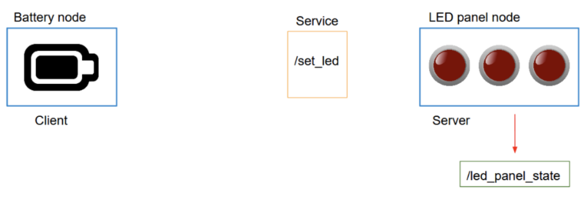
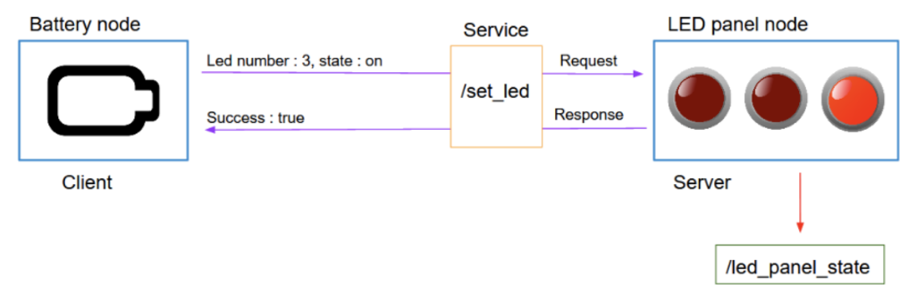
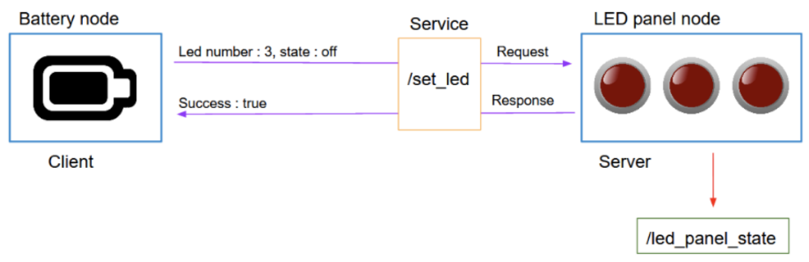
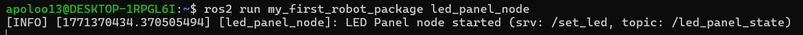
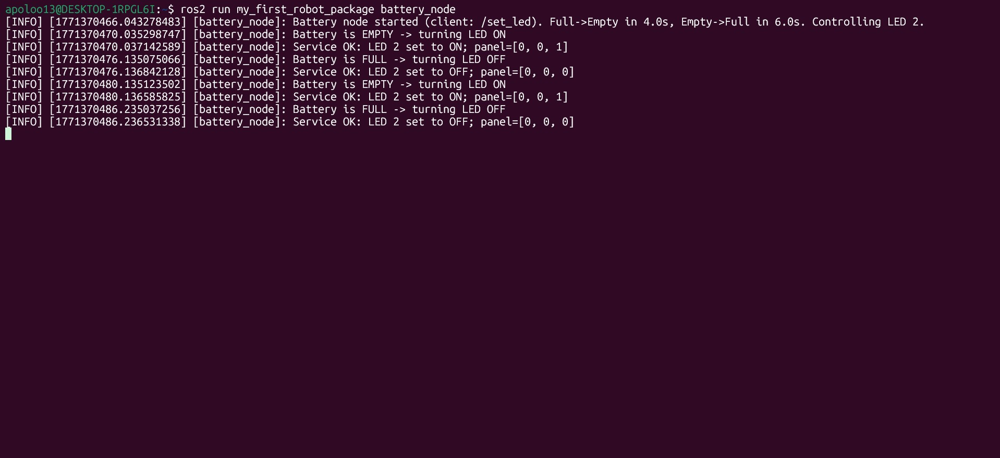
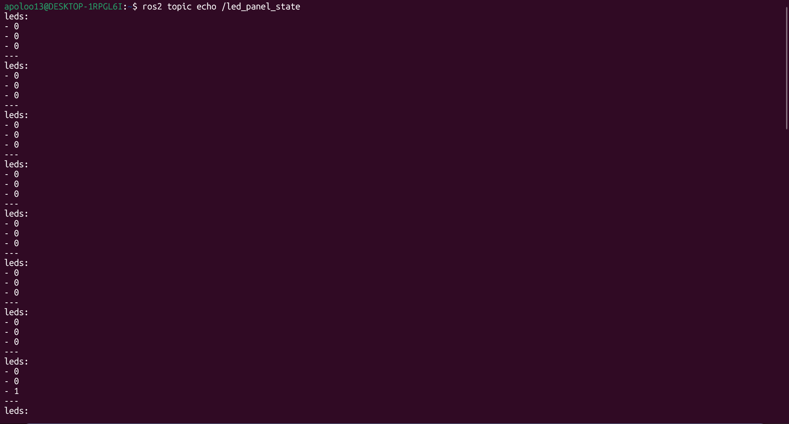
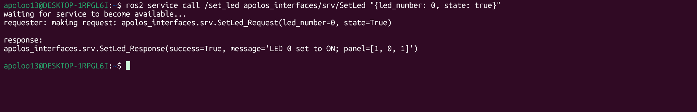
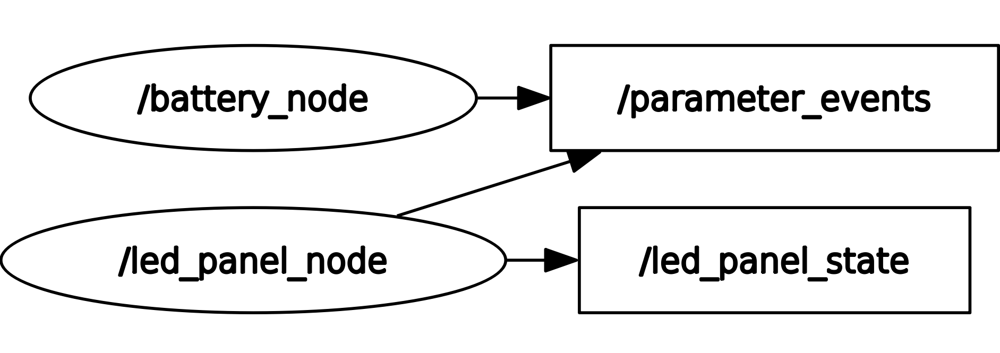

# Custom Service + Custom Message (Battery and LED Panel)

## 1. Overview

This homework implements a complete ROS 2 system with:

- One custom message: `LedPanelState.msg`
- One custom service: `SetLed.srv`
- One topic: `/led_panel_state` (publishes the LED panel status)
- One service: `/set_led` (turns a specific LED ON/OFF)
- Two nodes:
  - `led_panel_node` (service server + publisher)
  - `battery_node` (service client that simulates a battery and controls one LED)

General behavior:

- The battery starts “full”.
- After 4 seconds it becomes “empty” and the node turns ON one LED on the panel.
- After 6 additional seconds it becomes “full” and the node turns OFF that LED.
- This loop repeats forever.

---

## 2. Objectives

- Create a custom interface package with:
  - `apolos_interfaces/msg/LedPanelState.msg`
  - `apolos_interfaces/srv/SetLed.srv`
- Create the `led_panel_node` that:
  - Maintains an internal LED array (example: 3 LEDs -> `[0,0,0]`)
  - Publishes `/led_panel_state`
  - Provides `/set_led` service
- Create the `battery_node` that:
  - Simulates the battery timing
  - Calls `/set_led` to toggle one LED
- Build and run everything using `colcon`.
- Validate with `ros2 service call` and `ros2 topic echo`.

---

## 3. Requirements

- ROS 2 installed and sourced
- Python 3
- `colcon` build tools
- Custom interface package: `apolos_interfaces`
- Python package for nodes: `my_first_robot_package`

Useful inspection commands:

```bash
ros2 interface show apolos_interfaces/msg/LedPanelState
ros2 interface show apolos_interfaces/srv/SetLed
```




---

## 4. Package structure

Recommended workspace structure (example):

```
first_work-/src/
├─ apolos_interfaces/
│  ├─ CMakeLists.txt
│  ├─ package.xml
│  ├─ msg/
│  │  └─ LedPanelState.msg
│  └─ srv/
│     └─ SetLed.srv
└─ my_first_robot_package/
   ├─ package.xml
   ├─ setup.py
   ├─ setup.cfg
   └─ my_first_robot_package/
      ├─ __init__.py
      ├─ led_panel_node.py
      └─ battery_node.py
```

Important:
- In `ament_python`, the `.py` scripts must be inside the module folder:
  `my_first_robot_package/my_first_robot_package/`

---

## 5. Custom interfaces (apolos_interfaces)

### 5.1 Custom message

File: `apolos_interfaces/msg/LedPanelState.msg`

```text
int32[] leds
```

Meaning:
- `leds` is an integer array representing each LED state.
- Example with 3 LEDs:
  - `[0, 0, 0]` all OFF
  - `[0, 0, 1]` last LED ON

---

### 5.2 Custom service

File: `apolos_interfaces/srv/SetLed.srv`

```text
int32 led_number
bool state
---
bool success
string message
```

Meaning:
- Request:
  - `led_number`: which LED index to modify (example: 0..2)
  - `state`: `true` to turn ON, `false` to turn OFF
- Response:
  - `success`: whether the command was valid
  - `message`: description of what happened

---

### 5.3 CMakeLists.txt (interfaces package)

File: `apolos_interfaces/CMakeLists.txt`

```cmake
cmake_minimum_required(VERSION 3.8)
project(apolos_interfaces)

find_package(ament_cmake REQUIRED)
find_package(rosidl_default_generators REQUIRED)

rosidl_generate_interfaces(${PROJECT_NAME}
  "msg/LedPanelState.msg"
  "srv/SetLed.srv"
)

ament_export_dependencies(rosidl_default_runtime)
ament_package()
```

---

### 5.4 package.xml (interfaces package)

File: `apolos_interfaces/package.xml`

```xml
<?xml version="1.0"?>
<package format="3">
  <name>apolos_interfaces</name>
  <version>0.0.0</version>
  <description>Custom interfaces for battery + led panel homework</description>
  <maintainer email="apoloo13@todo.todo">apoloo13</maintainer>
  <license>TODO</license>

  <buildtool_depend>ament_cmake</buildtool_depend>

  <build_depend>rosidl_default_generators</build_depend>
  <exec_depend>rosidl_default_runtime</exec_depend>

  <member_of_group>rosidl_interface_packages</member_of_group>
</package>
```

---

## 6. Node 1: LED Panel (server + publisher)

File: `my_first_robot_package/led_panel_node.py`

### 6.1 Purpose

This node is responsible for the LED panel logic:

- Holds an internal list with the panel state (example: `[0, 0, 0]`)
- Publishes the panel state periodically on `/led_panel_state`
- Exposes a service `/set_led` to set one LED ON/OFF

### 6.2 Code (led_panel_node.py)

```python
#!/usr/bin/env python3
import rclpy
from rclpy.node import Node

from apolos_interfaces.msg import LedPanelState
from apolos_interfaces.srv import SetLed


class LedPanelNode(Node):
    def __init__(self):
        super().__init__("led_panel_node")

        # LED panel state (3 LEDs) -> [0, 0, 0] initially
        self.leds = [0, 0, 0]

        # Publisher: /led_panel_state
        self.pub_state = self.create_publisher(LedPanelState, "/led_panel_state", 10)
        self.timer = self.create_timer(0.5, self.publish_state)

        # Service server: /set_led
        self.srv = self.create_service(SetLed, "/set_led", self.cb_set_led)

        self.get_logger().info("LED Panel node started (srv: /set_led, topic: /led_panel_state)")

    def publish_state(self):
        msg = LedPanelState()
        msg.leds = self.leds
        self.pub_state.publish(msg)

    def cb_set_led(self, request: SetLed.Request, response: SetLed.Response):
        idx = int(request.led_number)

        if idx < 0 or idx >= len(self.leds):
            response.success = False
            response.message = f"Invalid led_number={idx}. Valid range: 0..{len(self.leds)-1}"
            self.get_logger().warn(response.message)
            return response

        self.leds[idx] = 1 if request.state else 0

        response.success = True
        response.message = f"LED {idx} set to {'ON' if request.state else 'OFF'}; panel={self.leds}"
        self.get_logger().info(response.message)
        return response


def main(args=None):
    rclpy.init(args=args)
    node = LedPanelNode()
    try:
        rclpy.spin(node)
    except KeyboardInterrupt:
        pass
    finally:
        node.destroy_node()
        rclpy.shutdown()


if __name__ == "__main__":
    main()
```

---

## 7. Node 2: Battery (client)

File: `my_first_robot_package/battery_node.py`

### 7.1 Purpose

This node simulates the battery timing and calls the service:

- Uses timing rules:
  - Full -> Empty after 4 seconds
  - Empty -> Full after 6 seconds
- When battery becomes empty:
  - Calls `/set_led` with `state=true`
- When battery becomes full:
  - Calls `/set_led` with `state=false`
- Repeats forever

### 7.2 Code (battery_node.py)

```python
#!/usr/bin/env python3
import rclpy
from rclpy.node import Node

from apolos_interfaces.srv import SetLed


class BatteryNode(Node):
    def __init__(self):
        super().__init__("battery_node")

        # Parameters (optional but useful)
        self.declare_parameter("led_number", 2)          # which LED to control (0..2)
        self.declare_parameter("time_to_empty", 4.0)     # seconds until empty
        self.declare_parameter("time_to_full", 6.0)      # seconds until full again

        self.led_number = int(self.get_parameter("led_number").value)
        self.time_to_empty = float(self.get_parameter("time_to_empty").value)
        self.time_to_full = float(self.get_parameter("time_to_full").value)

        # Service client: /set_led
        self.client = self.create_client(SetLed, "/set_led")

        # Battery state
        self.is_full = True
        self.state_start_time = self.get_clock().now()

        # Tick loop to simulate time
        self.timer = self.create_timer(0.1, self.tick)

        self.get_logger().info(
            f"Battery node started (client: /set_led). "
            f"Full->Empty in {self.time_to_empty}s, Empty->Full in {self.time_to_full}s. "
            f"Controlling LED {self.led_number}."
        )

    def seconds_since_state_start(self) -> float:
        now = self.get_clock().now()
        dt = now - self.state_start_time
        return dt.nanoseconds / 1e9

    def tick(self):
        elapsed = self.seconds_since_state_start()

        # Full -> Empty after time_to_empty seconds
        if self.is_full and elapsed >= self.time_to_empty:
            self.is_full = False
            self.state_start_time = self.get_clock().now()
            self.get_logger().info("Battery is EMPTY -> turning LED ON")
            self.call_set_led(self.led_number, True)

        # Empty -> Full after time_to_full seconds
        elif (not self.is_full) and elapsed >= self.time_to_full:
            self.is_full = True
            self.state_start_time = self.get_clock().now()
            self.get_logger().info("Battery is FULL -> turning LED OFF")
            self.call_set_led(self.led_number, False)

    def call_set_led(self, led_number: int, state: bool):
        if not self.client.service_is_ready():
            self.get_logger().warn("Service /set_led not available yet...")
            return

        req = SetLed.Request()
        req.led_number = int(led_number)
        req.state = bool(state)

        future = self.client.call_async(req)
        future.add_done_callback(self.on_response)

    def on_response(self, future):
        try:
            res = future.result()
            if res.success:
                self.get_logger().info(f"Service OK: {res.message}")
            else:
                self.get_logger().warn(f"Service FAIL: {res.message}")
        except Exception as e:
            self.get_logger().error(f"Service call failed: {e}")


def main(args=None):
    rclpy.init(args=args)
    node = BatteryNode()
    try:
        rclpy.spin(node)
    except KeyboardInterrupt:
        pass
    finally:
        node.destroy_node()
        rclpy.shutdown()


if __name__ == "__main__":
    main()
```

---

## 8. Register executables in setup.py

In your `my_first_robot_package/setup.py`, ensure the console scripts include:

```python
entry_points={
    "console_scripts": [
        "led_panel_node = my_first_robot_package.led_panel_node:main",
        "battery_node = my_first_robot_package.battery_node:main",
    ],
},
```

---

## 9. Build and run

### 9.1 Build the workspace

```bash
cd ~/first_work-/src
colcon build --symlink-install
source install/setup.bash
```

---

### 9.2 Terminal A (LED Panel node)

Image placeholder (Terminal A evidence):



Commands (Terminal A):

```bash
source ~/first_work-/src/install/setup.bash
ros2 run my_first_robot_package led_panel_node
```

---

### 9.3 Terminal B (Battery node)

Image placeholder (Terminal B evidence):



Commands (Terminal B):

```bash
source ~/first_work-/src/install/setup.bash
ros2 run my_first_robot_package battery_node
```

---

### 9.4 Terminal C (Observe topic)

Image placeholder (Terminal C evidence):



Commands (Terminal C):

```bash
source ~/first_work-/src/install/setup.bash
ros2 topic echo /led_panel_state
```

---

## 10. Manual test (service call)

You can test the service without the battery node.

Image placeholder (service call evidence):



Commands:

```bash
source ~/first_work-/src/install/setup.bash
ros2 service call /set_led apolos_interfaces/srv/SetLed "{led_number: 2, state: true}"
ros2 service call /set_led apolos_interfaces/srv/SetLed "{led_number: 2, state: false}"
```

---

## 11. Optional verification

List nodes:

```bash
ros2 node list
```

List topics:

```bash
ros2 topic list
```

List services:

```bash
ros2 service list
```

Check the custom interfaces:

```bash
ros2 interface show apolos_interfaces/msg/LedPanelState
ros2 interface show apolos_interfaces/srv/SetLed
```

Graph view:

```bash
rqt_graph
```



---

## 12. Troubleshooting

1) Interface import errors (cannot import `apolos_interfaces.msg` or `apolos_interfaces.srv`)
- Rebuild and re-source the workspace:
  ```bash
  cd ~/first_work-/src
  colcon build --symlink-install
  source install/setup.bash
  ```
- Ensure `apolos_interfaces` is built before `my_first_robot_package` (colcon handles this if dependencies are correct).

2) Service not available (`Service /set_led not available yet...`)
- Start Terminal A first (LED Panel node).
- Verify with:
  ```bash
  ros2 service list
  ```

3) Wrong LED index
- If you only have 3 LEDs, valid indices are `0, 1, 2`.
- The service will return `success=false` if the index is invalid.

4) Topic not publishing
- Confirm the LED Panel node is running.
- Check:
  ```bash
  ros2 topic list
  ros2 topic echo /led_panel_state
  ```

---
