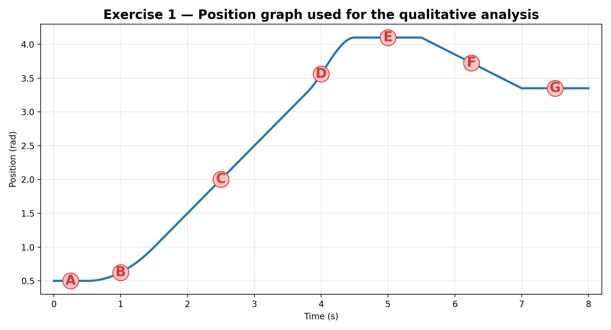
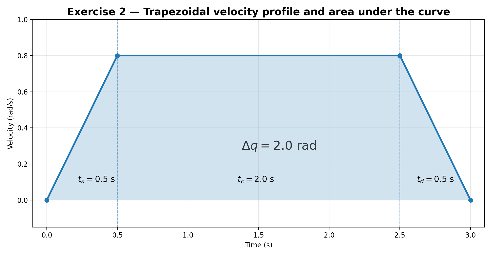
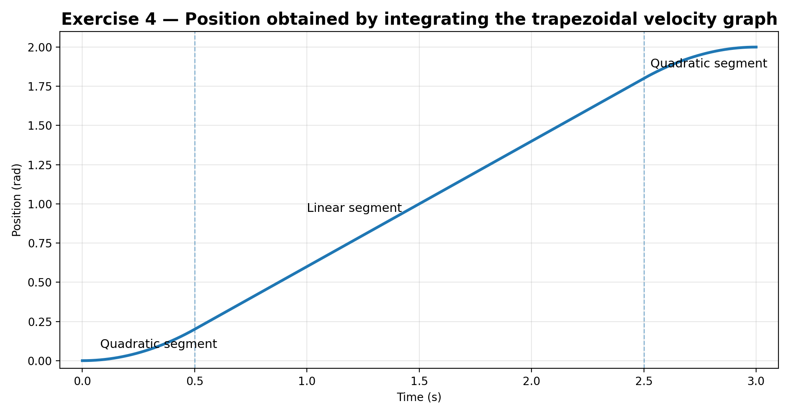
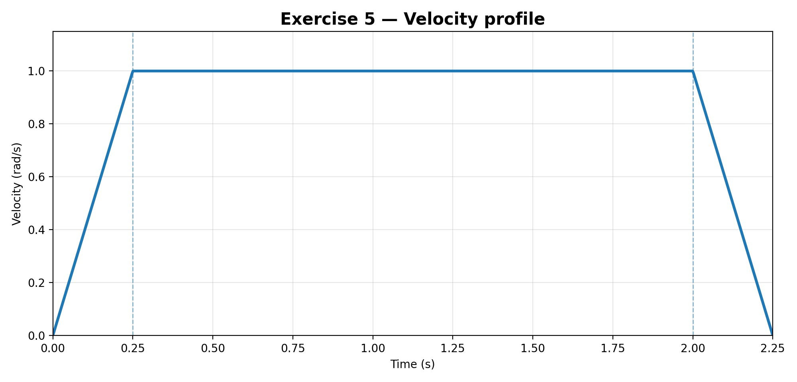
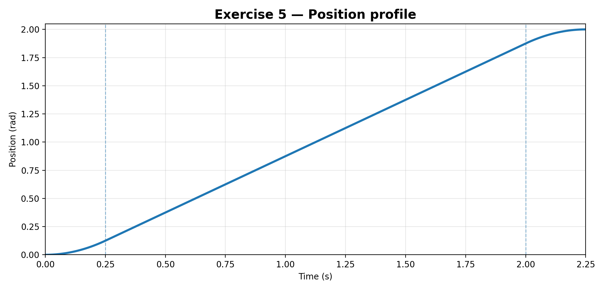
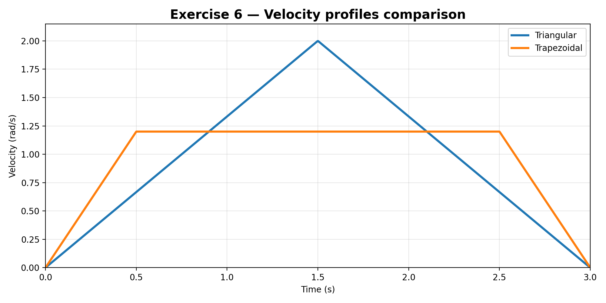
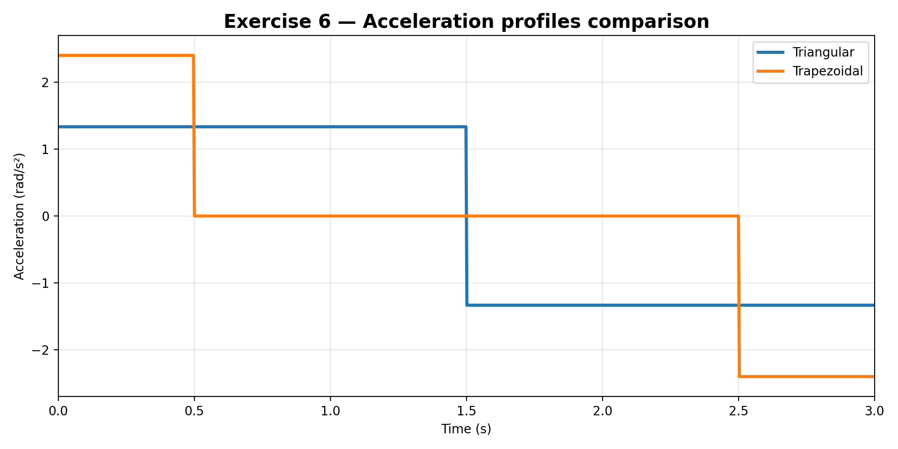

# Trajectory Planning Exercises

## 1. Overview

This document verifies the trajectory-planning exercises using the relationships between position, velocity, and acceleration, together with the standard trapezoidal and triangular velocity profiles.

Two important clarifications are necessary before presenting the solutions:

1. In the material that was shared, the numerical data for **Exercise 3(a)** and **Exercise 3(b)** are not visible.  
   Therefore, that exercise is solved with the **exact decision criterion and substitution procedure**, but it cannot be closed numerically without those missing values.

2. For **Exercise 4**, no independent velocity graph was visible in the shared page.  
   To keep the solution consistent and complete, the corresponding position sketch is built from the **trapezoidal velocity graph of Exercise 2**, which is the only explicit velocity graph available.

---

## 2. Theoretical basis

For any joint trajectory:

$$
v(t) = \dot{q}(t), \qquad a(t) = \dot{v}(t) = \ddot{q}(t)
$$

This implies:

- the **slope of the position graph** is the velocity,
- the **slope of the velocity graph** is the acceleration,
- the **area under the velocity-time graph** is the displacement.

For a symmetric trapezoidal velocity profile:

$$
q_a = \frac{v_{\max}^2}{2a_{\max}}
$$

$$
q_{\min} = q_a + q_d = \frac{v_{\max}^2}{a_{\max}}
$$

where \( q_{\min} \) is the minimum distance required to accelerate up to \( v_{\max} \) and then decelerate back to zero.

Therefore:

- if \( \Delta q > q_{\min} \), the motion is **trapezoidal**,
- if \( \Delta q = q_{\min} \), it is the **limit case with zero cruise**,
- if \( \Delta q < q_{\min} \), the motion is **triangular**.

---

## 3. Exercise 1

### Statement

Given a position graph, identify:

- where velocity is zero,
- where velocity is maximum,
- where acceleration is positive or negative.

### Graph used for the analysis

### Procedure

From a position graph:

- \( v(t) \) is the slope of \( q(t) \),
- positive slope means positive velocity,
- zero slope means zero velocity,
- increasing slope means positive acceleration,
- decreasing slope means negative acceleration.

### Point-by-point interpretation

| Point | Graph behavior | Velocity | Acceleration |
|---|---|---:|---:|
| A | Horizontal segment | \(0\) | \(0\) |
| B | Curve rising with increasing slope | \(>0\) | \(>0\) |
| C | Steep straight segment | maximum positive | \(0\) |
| D | Curve still rising, but flattening | \(>0\) | \(<0\) |
| E | Horizontal plateau | \(0\) | \(0\) |
| F | Straight descending segment | \(<0\) | \(0\) |
| G | Horizontal segment | \(0\) | \(0\) |

### Final answer

- **Velocity is zero** at **A, E, and G**.
- **Maximum velocity** occurs at **C**, because that is where the positive slope is greatest.
- **Positive acceleration** occurs around **B**, because the slope is increasing.
- **Negative acceleration** occurs around **D**, because the slope is decreasing.
- At **F** the velocity is negative and approximately constant, so the acceleration there is approximately zero.

---

## 4. Exercise 2

### Statement

Given a trapezoidal velocity graph, compute the total displacement from the area under the curve.

### Velocity graph

### Known data

$$
v_{\max} = 0.8\ \text{rad/s}, \qquad
t_a = 0.5\ \text{s}, \qquad
t_c = 2.0\ \text{s}, \qquad
t_d = 0.5\ \text{s}
$$

### Procedure

The total displacement is the sum of:

1. the area of the acceleration triangle,
2. the area of the constant-velocity rectangle,
3. the area of the deceleration triangle.

So,

$$
\Delta q
=
\frac{1}{2} t_a v_{\max}
+
t_c v_{\max}
+
\frac{1}{2} t_d v_{\max}
$$

Substituting the numerical values:

$$
\Delta q
=
\frac{1}{2}(0.5)(0.8)
+
(2.0)(0.8)
+
\frac{1}{2}(0.5)(0.8)
$$

$$
\Delta q = 0.2 + 1.6 + 0.2 = 2.0\ \text{rad}
$$

### Result

$$
\boxed{\Delta q = 2.0\ \text{rad}}
$$

---

## 5. Exercise 3

### Statement

Given \( \Delta q \), \( v_{\max} \), and \( a_{\max} \), determine whether the motion is trapezoidal or triangular.

### Important note

The numerical values for parts **(a)** and **(b)** are not visible in the material that was shared, so this exercise cannot be completed numerically without inventing data.  
What can be done correctly is to leave the exact decision rule and substitution sequence ready.

### Decision criterion

First compute the minimum distance needed to reach \( v_{\max} \):

$$
q_{\min} = \frac{v_{\max}^2}{a_{\max}}
$$

Then compare \( \Delta q \) against \( q_{\min} \):

- if \( \Delta q > q_{\min} \), the profile is **trapezoidal**,
- if \( \Delta q = q_{\min} \), the cruise time is zero,
- if \( \Delta q < q_{\min} \), the profile is **triangular**.

### If the result is trapezoidal

$$
t_a = \frac{v_{\max}}{a_{\max}}
$$

$$
t_c = \frac{\Delta q}{v_{\max}} - \frac{v_{\max}}{a_{\max}}
$$

$$
T = 2t_a + t_c
$$

### If the result is triangular

The peak velocity is not \( v_{\max} \), but the reachable value \( v_p \):

$$
v_p = \sqrt{\Delta q\,a_{\max}}
$$

$$
t_a = \frac{v_p}{a_{\max}}
$$

$$
T = 2t_a
$$

### Ready-to-use substitution template

| Case | Formula |
|---|---|
| Minimum distance to reach \(v_{\max}\) | \( q_{\min} = \dfrac{v_{\max}^2}{a_{\max}} \) |
| Comparison | compare \( \Delta q \) with \( q_{\min} \) |
| Trapezoidal acceleration time | \( t_a = \dfrac{v_{\max}}{a_{\max}} \) |
| Trapezoidal cruise time | \( t_c = \dfrac{\Delta q}{v_{\max}} - \dfrac{v_{\max}}{a_{\max}} \) |
| Triangular peak velocity | \( v_p = \sqrt{\Delta q a_{\max}} \) |
| Triangular total time | \( T = 2\dfrac{v_p}{a_{\max}} \) |

---

## 6. Exercise 4

### Statement

Sketch the position graph corresponding to a given velocity graph.

### Assumption used here

Because no separate Exercise 4 velocity graph was visible in the shared material, the position graph below is obtained from the trapezoidal velocity graph of Exercise 2.

### Velocity law used

From Exercise 2:

$$
v(t)=
\begin{cases}
1.6t, & 0 \le t \le 0.5 \\
0.8, & 0.5 < t \le 2.5 \\
0.8 - 1.6(t-2.5), & 2.5 < t \le 3
\end{cases}
$$

### Position by integration

Assuming \( q(0)=0 \),

#### Phase 1: acceleration

$$
q(t)=\int 1.6t\,dt = 0.8t^2,
\qquad 0 \le t \le 0.5
$$

At \( t=0.5 \),

$$
q(0.5)=0.8(0.5)^2=0.2\ \text{rad}
$$

#### Phase 2: constant velocity

$$
q(t)=0.2+0.8(t-0.5),
\qquad 0.5 < t \le 2.5
$$

This can also be written as

$$
q(t)=0.8t-0.2
$$

At \( t=2.5 \),

$$
q(2.5)=0.2+0.8(2.0)=1.8\ \text{rad}
$$

#### Phase 3: deceleration

$$
q(t)=1.8 + 0.8(t-2.5) - 0.8(t-2.5)^2,
\qquad 2.5 < t \le 3
$$

At \( t=3 \),

$$
q(3)=2.0\ \text{rad}
$$

### Position graph

### Interpretation

The resulting position graph has the expected shape:

- **quadratic increasing** during acceleration,
- **linear** during constant velocity,
- **quadratic increasing but flattening** during deceleration.

---

## 7. Exercise 5

### Statement

A joint must move \( \Delta q = 2\ \text{rad} \) with \( v_{\max}=1\ \text{rad/s} \) and \( a_{\max}=4\ \text{rad/s}^2 \).

Tasks:

a) Determine whether the motion is trapezoidal or triangular.  
b) Compute \( t_a \), \( t_c \), and \( T \).  
c) Write the velocity function \( \dot q(t) \) for each phase.  
d) Write the position function \( q(t) \) for each phase, assuming \( q_0=0 \).

### a) Profile type

First compute the minimum distance required to reach \( v_{\max} \):

$$
q_{\min} = \frac{v_{\max}^2}{a_{\max}}
= \frac{1^2}{4}
= 0.25\ \text{rad}
$$

Since

$$
\Delta q = 2\ \text{rad} > 0.25\ \text{rad}
$$

the motion **does reach** the commanded maximum velocity.

Therefore,

$$
\boxed{\text{The profile is trapezoidal}}
$$

### b) Computation of \( t_a \), \( t_c \), and \( T \)

Acceleration time:

$$
t_a = \frac{v_{\max}}{a_{\max}}
= \frac{1}{4}
= 0.25\ \text{s}
$$

Cruise time:

$$
t_c = \frac{\Delta q}{v_{\max}} - \frac{v_{\max}}{a_{\max}}
= \frac{2}{1} - \frac{1}{4}
= 1.75\ \text{s}
$$

Total time:

$$
T = 2t_a + t_c = 2(0.25) + 1.75 = 2.25\ \text{s}
$$

### Results

$$
\boxed{t_a = 0.25\ \text{s}}, \qquad
\boxed{t_c = 1.75\ \text{s}}, \qquad
\boxed{T = 2.25\ \text{s}}
$$

### c) Velocity function \( \dot q(t) \)

The deceleration phase starts at

$$
t_b = t_a + t_c = 0.25 + 1.75 = 2.0\ \text{s}
$$

Therefore,

$$
\dot q(t)=
\begin{cases}
4t, & 0 \le t \le 0.25 \\
1, & 0.25 < t \le 2.0 \\
1 - 4(t-2.0), & 2.0 < t \le 2.25
\end{cases}
$$

### d) Position function \( q(t) \), with \( q_0=0 \)

#### Phase 1

$$
q(t)=\int_0^t 4\tau\,d\tau = 2t^2,
\qquad 0 \le t \le 0.25
$$

At the end of acceleration:

$$
q(0.25)=2(0.25)^2=0.125\ \text{rad}
$$

#### Phase 2

$$
q(t)=0.125 + 1(t-0.25),
\qquad 0.25 < t \le 2.0
$$

Equivalent simplified form:

$$
q(t)=t-0.125
$$

At the start of deceleration:

$$
q(2.0)=2.0-0.125=1.875\ \text{rad}
$$

#### Phase 3

$$
q(t)=1.875 + (t-2.0) - 2(t-2.0)^2,
\qquad 2.0 < t \le 2.25
$$

### Final piecewise position function

$$
q(t)=
\begin{cases}
2t^2, & 0 \le t \le 0.25 \\
t-0.125, & 0.25 < t \le 2.0 \\
1.875 + (t-2.0) - 2(t-2.0)^2, & 2.0 < t \le 2.25
\end{cases}
$$

### Graphs

### Verification

At the final time,

$$
q(2.25)=1.875 + 0.25 - 2(0.25)^2 = 2.0\ \text{rad}
$$

so the position function is consistent with the required displacement.

---

## 8. Exercise 6

### Statement

A joint must move \( \Delta q = 3\ \text{rad} \) in exactly \( T=3\ \text{s} \).

Tasks:

a) Design a triangular velocity profile. Compute \( v_p \) and \( a \).  
b) Design a trapezoidal velocity profile with \( t_a=0.5\ \text{s} \). Compute \( v_{\max} \) and \( a_{\max} \).  
c) Compare the peak acceleration of both profiles and identify which one is gentler on the motor.

### a) Triangular profile

For a symmetric triangular velocity profile,

$$
\Delta q = \frac{1}{2} T v_p
$$

So,

$$
3 = \frac{1}{2}(3)v_p
\quad \Longrightarrow \quad
v_p = 2\ \text{rad/s}
$$

Since the profile is symmetric,

$$
t_a = \frac{T}{2} = 1.5\ \text{s}
$$

The required acceleration is

$$
a = \frac{v_p}{t_a}
= \frac{2}{1.5}
= \frac{4}{3}
\approx 1.333\ \text{rad/s}^2
$$

### Triangular-profile result

$$
\boxed{v_p = 2\ \text{rad/s}}, \qquad
\boxed{a = \frac{4}{3}\ \text{rad/s}^2 \approx 1.333\ \text{rad/s}^2}
$$

### Triangular velocity function

$$
v_{\text{tri}}(t)=
\begin{cases}
\frac{4}{3}t, & 0 \le t \le 1.5 \\
2 - \frac{4}{3}(t-1.5), & 1.5 < t \le 3
\end{cases}
$$

### b) Trapezoidal profile with \( t_a=0.5\ \text{s} \)

Because the total time is fixed at \( 3\ \text{s} \),

$$
t_c = T - 2t_a = 3 - 2(0.5) = 2.0\ \text{s}
$$

For a symmetric trapezoidal profile:

$$
\Delta q = v_{\max}(t_c + t_a)
$$

Then,

$$
3 = v_{\max}(2.0 + 0.5)
= 2.5\,v_{\max}
$$

$$
v_{\max} = \frac{3}{2.5} = 1.2\ \text{rad/s}
$$

Now compute the acceleration:

$$
a_{\max}=\frac{v_{\max}}{t_a}
=\frac{1.2}{0.5}
=2.4\ \text{rad/s}^2
$$

### Trapezoidal-profile result

$$
\boxed{v_{\max}=1.2\ \text{rad/s}}, \qquad
\boxed{a_{\max}=2.4\ \text{rad/s}^2}
$$

### Trapezoidal velocity function

$$
v_{\text{trap}}(t)=
\begin{cases}
2.4t, & 0 \le t \le 0.5 \\
1.2, & 0.5 < t \le 2.5 \\
1.2 - 2.4(t-2.5), & 2.5 < t \le 3
\end{cases}
$$

### c) Comparison of peak acceleration

Triangular profile:

$$
a_{\text{peak,tri}} = \frac{4}{3} \approx 1.333\ \text{rad/s}^2
$$

Trapezoidal profile:

$$
a_{\text{peak,trap}} = 2.4\ \text{rad/s}^2
$$

Since

$$
1.333 < 2.4
$$

the triangular profile has the smaller peak acceleration.

### Final conclusion for Exercise 6

$$
\boxed{\text{The triangular profile is gentler on the motor}}
$$

because lower peak acceleration generally implies lower peak torque demand, lower mechanical stress, and smaller dynamic shock.

### Graphs

### Comparative summary

| Profile | \(t_a\) [s] | \(t_c\) [s] | Peak velocity [rad/s] | Peak acceleration [rad/s²] |
|---|---:|---:|---:|---:|
| Triangular | 1.5 | 0 | 2.0 | 1.333 |
| Trapezoidal | 0.5 | 2.0 | 1.2 | 2.4 |

## 9. Resource included in this package

The package also includes a Python script that generates the figures used in this document:

- `docs/recursos/imgs/homework8/plot_trajectory_exercises.py`
